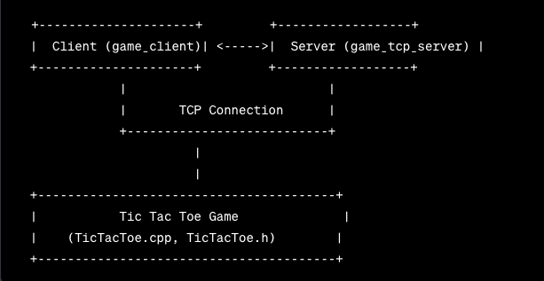

# How to Build and Run

## Server:

1. Navigate to the `src/tcp_server` folder.
2. Build the server using the Makefile: `make server`.
3. Run the server with `./binaries/game_tcp_server`.

## Client:

1. Navigate to the `src/client` folder.
2. Build the client using the Makefile: `make client`.
3. Run the client with `./binaries/game_client`.

## Tests:

Build and run the tests using the Makefile: `make test`.

## 🎮 Gameplay

- Connect two clients to the server.
- Clients will be assigned 'X' and 'O'.
- Use the following format to make a move: `X<space>Y` where `X` and `Y` are the coordinates (0-2).
- Example: `1 1` represents placing a symbol in the center.

## Class diagram

## 📝 Notes

- The server uses a simple TCP connection to handle two clients.
- The Tic Tac Toe game logic is implemented in the `TicTacToe` class.
- The server and client communicate using a custom protocol for moves and messages.

## 🚀 GitHub Actions

The repository is configured with GitHub Actions to automate the build and release process:

### Build and Test:

- Automatically builds and tests the project on every push to the main branch.
- Checks for any build or test failures.

### Release:

- Generates a release when code is merged into the main branch.
- The release includes the compiled binaries for the server (`game_tcp_server`) and client (`game_client`).
- The release is tagged with the format `v1.x` where `x` is the GitHub Actions run number.

To download the released binaries, navigate to the [Releases](https://github.com/kaizen-cmd/cpp-tcp-server-tic-tac-toe/releases) section on GitHub.

Feel free to explore and modify the code and GitHub Actions workflows for your needs!
